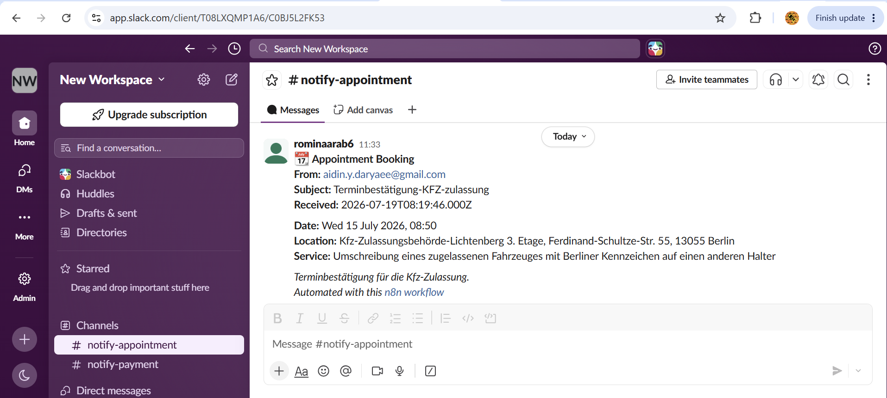

# AI Email Classifier with n8n

An AI-powered email automation workflow built with **n8n**, **OpenAI GPT-5-mini**, **Gmail**, and **Slack**.

The workflow monitors incoming Gmail messages, uses an LLM to classify and extract important information, and automatically sends structured notifications to different Slack channels based on the detected category.

---

## Features

- 📩 Monitors unread Gmail emails
- 🤖 Uses GPT-5-mini to classify email intent
- 📅 Detects appointment booking emails
- 📝 Extracts appointment details:
  - Date & Time
  - Location
  - Service/Purpose
- 🔀 Routes emails automatically based on category
- 💬 Sends formatted Slack notifications
- ⚡ Runs automatically using n8n

---

## Workflow

```
Gmail Trigger
      │
      ▼
AI Classification & Information Extraction
      │
      ▼
Category Router
      │
      ▼
Appointment
      │
      ▼
Slack Alert
```

---

## Technologies

- n8n
- OpenAI GPT-5-mini
- Gmail Trigger
- Slack API
- Structured JSON Output

---

## Example

When an appointment confirmation email arrives, the workflow extracts:

- Category
- Summary
- Appointment date
- Appointment location
- Appointment purpose

and posts a structured notification directly to Slack.

---

## Screenshots

### n8n Workflow


### Slack Notification



---

## Repository

The complete n8n workflow can be imported directly from:

```

Al Email Classifier.json

```
